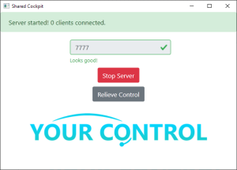

[](https://forthebadge.com)

A simple shared cockpit solution for MSFS2020.

## Features
* Frequent and smooth position updates through linear interpolation
* Transferable controls and synchronized switches

## Setup
1. Grab the latest [release](https://github.com/Sequal32/yourcontrol/releases/latest) and unzip to a directory of your choice.
1. Launch FS2020 and make sure you and your partner(s) spawn in *close* to each other in the **same aircraft state** (all spawn on runway or all spawn on ramp)
1. Start up the included .exe file.
    * Server: **Port forward** either `7777` or the specified port in the application. Navigate to the server tab, enter port and click start server. You will have initial control of the aircraft.
    * Clients: Navigate to the client tab and enter the **server's ip and port** and click connect.
1. Fly!
2. To transfer control, you can either assign a key to `Toggle Water Rudder` or use the UI to either
   * **Relieve control** if you're currently flying
   * **Accept control** when the person flying relieves control
## Configuring
Config.json
```
{
  "port": 7777, // The default port shown in the app for client & server
  "ip": "", // The last entered ip
  "buffer_size": 3, // How many packets to buffer. Useful for unstable connections.
  "update_rate": 30, // The update rate in hz. Setting this above 60hz may be unstable
  "conn_timeout": 10.0 // When control should be taken back after a packet hasn't been received for X amount of seconds
}
```

<details>
    <summary>Screenshots</summary>
    
</details>

## Known bugs
* The number of connections shown on the server may be inaccurate as clients disconnect.
* The client will still show connected to the server after the server closes - circumvented by the connection timeout defined in the config.json.
* Not all switchable switches are currently synchronized due to the current state of SimConnect.

## Remarks
* The `.dat` files can be freely modified, but they must match a certain specification otherwise the application will not work correctly.
* The code's architecture is loosely defined, so looking at the code may prove challenging.
* Currently this program only supports two people (one server, one client).

## Data Files
* `sim_vars.dat` comprises all the simulation variables that will be synced every tick.
* `sim_events.dat` comprises all the simulation events that the program will listen to and sync when triggered.
* `sync_bools.dat` is composed of a combination of simulation variables and simulation events that will sync upon initial connection. The simulation variables defined will help the program to determine when and how to sync the specified variables.
